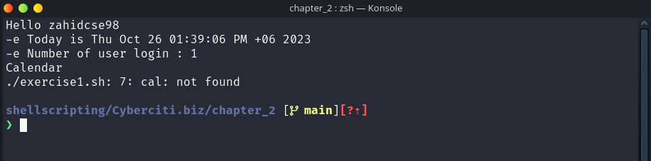
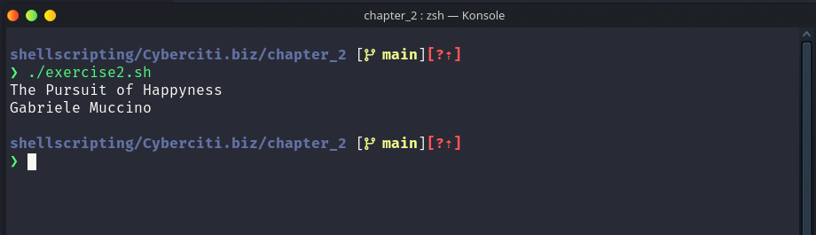
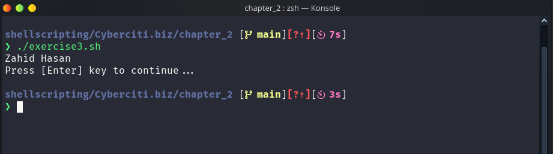
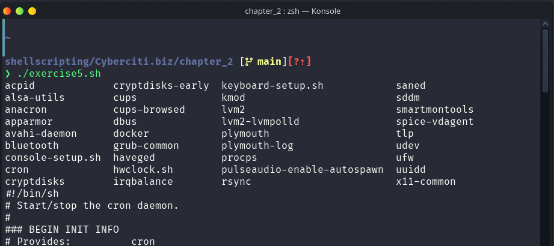

- **Exercise 1:**

  - **Write the following shell script and note the output:**

  ```
    # Script to print currently logged in users information, and current date & time.
    clear
    echo "Hello $USER"
    echo -e "Today is \c ";date
    echo -e "Number of user login : \c" ; who | wc -l
    echo "Calendar"
    cal
    exit 0
  ```

  - **Output:**

  

- **Exercise 2:**

  - **Write a program that prints your favorite movie name. It should print director name on the next line.:**
  - **Solution:**

  ```
    #!/bin/bash
    echo "The Pursuit of Happyness"
    echo "Gabriele Muccino"
  ```

  - **Output:**

    

- **Exercise 3:**

  - **Write a shell script that prints out your name and waits for the user to press the [Enter] key before the script ends.:**
  - **Solution:**

  ```
    #!/bin/bash
    echo "Zahid Hasan"
    read -p "Press [Enter] key to continue..."
  ```

  - **Output:**

    

- **Exercise 4:**

  - **List 10 builtin and external commands.:**
  - **Solution:**

    - **Built-in Commands:**

      1. `cd`: Used to change the current directory.
      2. `echo`: Displays a message or the value of a variable on the terminal.
      3. `pwd`: Prints the current working directory.
      4. `exit`: Exits the current shell or script.
      5. `alias`: Creates and manages command aliases.
      6. `history`: Displays the command history.
      7. `export`: Sets environment variables for use in child processes.
      8. `unset`: Removes environment variables or shell options.
      9. `source` (or .): Executes commands from a file within the current shell.
      10. `type`: Displays information about the type of a command (built-in, external, alias, etc.).

    - **External Commands:**
      1. `ls`: Lists files and directories in the current directory.
      2. `grep`: Searches for patterns in text using regular expressions.
      3. `curl`: A command-line tool for transferring data with URLs.
      4. `tar`: Used to archive and extract files.
      5. `cat`: Concatenates and displays the contents of files.
      6. `ping`: Tests network connectivity to a remote host.
      7. `chmod`: Changes file permissions.
      8. `find`: Searches for files and directories within a specified location.
      9. `ssh`: Secure Shell for remote login and command execution.
      10. `wget`: Downloads files from the internet using HTTP, HTTPS, or FTP.

- **Exercise 5:**

  - **cd to /etc/init.d and view various system init scripts.:**
  - **Solution:**

  ```
    #!/bin/bash
    cd /etc/init.d
    ls
    cat cron
  ```

  - **Output:**

    
